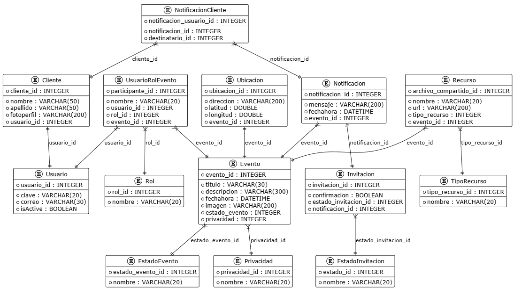

El siguiente diagrama de casos de uso representa las principales interacciones dentro del Sistema de Gestión de Eventos. En este sistema, los clientes pueden registrarse, iniciar sesión, acceder al detalle de los eventos, administrar su perfil y cerrar sesión.

El asistente, como especialización del cliente, tiene la posibilidad de explorar eventos públicos, consultar notificaciones y gestionar los eventos a los que está inscrito. Por su parte, el organizador cuenta con funcionalidades adicionales que le permiten crear y administrar sus propios eventos, incluyendo la edición y eliminación de los mismos, así como la gestión de recursos e invitados.

Estas funcionalidades en conjunto aseguran una experiencia completa tanto para los asistentes como para los organizadores, facilitando la creación, consulta y participación en eventos dentro de la plataforma móvil.

A continuación, se detallan los casos de uso:

| Código | Nombre                        | Actor       | Descripción                                                                                                                                  |
| ------ | ----------------------------- | ----------- | -------------------------------------------------------------------------------------------------------------------------------------------- |
| UC1    | Registrarse                   | Usuario     | Permite a los usuarios crear una nueva cuenta en el sistema y activarla para poder acceder a sus funcionalidades.                            |
| UC2    | Iniciar sesión                | Usuario     | Permite a los usuarios autenticarse ingresando sus credenciales en la aplicación.                                                            |
| UC3    | Explorar eventos públicos     | Usuario     | Permite al usuario visualizar y explorar todos los eventos disponibles al público.                                                           |
| UC4    | Consultar notificaciones      | Usuario     | Permite al usuario visualizar todas las notificaciones recibidas, incluyendo invitaciones privadas, y confirmar su asistencia a los eventos. |
| UC5    | Consultar eventos asistidos   | Usuario     | Permite al usuario visualizar los eventos a los que está inscrito y desvincularse de ellos si lo desea.                                      |
| UC6    | Crear evento                  | Organizador | Permite al organizador crear un nuevo evento, definiendo sus características principales.                                                    |
| UC7    | Consultar eventos creados     | Organizador | Permite al organizador visualizar, editar o eliminar los eventos que ha creado.                                                              |
| UC8    | Acceder al detalle del evento | Usuario     | Permite al usuario consultar información completa de un evento, incluyendo ubicación, recursos y detalles relevantes.                        |
| UC9    | Administrar un evento         | Organizador | Permite al organizador gestionar los recursos e invitados de un evento específico.                                                           |
| UC10   | Administrar perfil            | Usuario     | Permite al usuario consultar y actualizar su información personal.                                                                           |
| UC11   | Cerrar sesión                 | Usuario     | Permite al usuario cerrar su sesión de manera segura en la aplicación.                                                                       |

Y el diagrama de clases es el siguiente:

