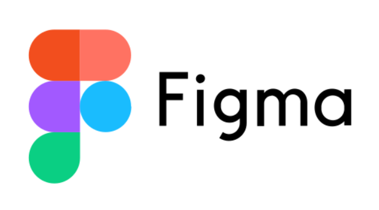

<h1 align="center">EventMaster</h1>

Este aplicativo móvil es...

## Índice

- [Configuración del Ambiente de Desarrollo](#configuración-del-ambiente-de-desarrollo)
- [Diagrama de Despliegue](#diagrama-de-despliegue)
- [Requerimientos No Funcionales](#requerimientos-no-funcionales)
- [Diagrama de Casos de Uso](#diagrama-de-casos-de-uso)
- [Prototipos](#prototipos)

## Configuración del Ambiente de Desarrollo

Paso a paso que se usará en el proyecto.

### Android Studio
|  |
|:--:|
| *Figura 1: Descripción de Android Studio* |

Android Studio es el entorno de desarrollo oficial para crear aplicaciones Android. Ofrece un editor de código inteligente, diseño visual de interfaces, emuladores de dispositivos y un sistema de compilación basado en Gradle.

En **EventMaster**, lo usaremos para emular el dispositivo móvil y probar la app sin necesidad de exportarla. Además, al momento de generar builds, Android Studio nos proveerá los SDK y herramientas necesarios.

---

### Flutter
|  |
|:--:|
| *Figura 2: Descripción de Flutter* |

Flutter es un framework de desarrollo de código abierto creado por Google para construir aplicaciones nativas multiplataforma (Android, iOS, web y escritorio) usando un solo código base. Utiliza el lenguaje **Dart** y destaca por su alto rendimiento y su sistema de widgets personalizables.

Para **EventMaster**, Flutter será la base del **cliente móvil**: pantallas de exploración de eventos, compra de tickets, billetera de entradas y lector de **códigos QR** para validación en puerta.

---

### Ruby on Rails
|  |
|:--:|
| *Figura 3: Descripción de Ruby on Rails* |

Ruby on Rails es un framework web basado en el patrón **MVC** que acelera el desarrollo mediante convenciones y buenas prácticas. Facilita la creación de **APIs REST** de forma estructurada y mantenible.

En **EventMaster**, Rails implementará la API: autenticación **JWT**, gestión de usuarios, eventos, órdenes/entradas y endpoints para **validación de tickets por QR**. También manejará notificaciones (p. ej., cambios de horario o ubicación de un evento).

---

### SQLite
|  |
|:--:|
| *Figura 4: Descripción de SQLite* |

SQLite es un motor de base de datos relacional, ligero y autónomo, que almacena los datos en un único archivo local. No requiere servidor y es ideal para entornos de desarrollo y pruebas.

Para **EventMaster**, lo usaremos en desarrollo para persistir información de usuarios, eventos y tickets. En producción, la migración a un motor como **PostgreSQL** es recomendable para mayor concurrencia y escalabilidad.

---

## Prototipo (Figma)

|  |
|:--:|
| *Figura 5: Prototipo de la app en Figma* |

Usamos **Figma** para diseñar y validar la **UI/UX** de EventMaster antes del desarrollo.  
El prototipo incluye los flujos principales:

- Registrarse  
- Iniciar sesión  
- Crear evento  
- Ver eventos gestionados  
- Eliminar evento  
- Editar perfil  
- Explorar eventos

## Diagrama de Despliegue

   

## Requerimientos No Funcionales

A continuación, se detallan los requerimientos no funcionales del sistema:

### 1. Escalabilidad
El sistema deberá estar preparado para gestionar un incremento progresivo en el número de usuarios, eventos y recursos compartidos sin afectar su rendimiento. La arquitectura backend deberá permitir escalamiento horizontal para atender picos de uso, como en eventos masivos o campañas promocionales.

### 2. Alta disponibilidad
El servicio deberá garantizar una disponibilidad mínima del **99.9%** mensual, asegurando acceso constante a los usuarios, especialmente durante eventos programados. Se debe implementar un sistema de recuperación ante fallos y redundancia en los servidores para evitar caídas del servicio.

### 3. Seguridad y privacidad
La comunicación entre cliente y servidor se realizará mediante **HTTPS**, y se utilizarán **tokens JWT** para autenticación y autorización de usuarios.  
Además, los **eventos privados** deberán contar con controles que impidan el acceso a usuarios no invitados, protegiendo detalles como ubicación, recursos adjuntos y lista de asistentes.

### 4. Compatibilidad multiplataforma
La aplicación, desarrollada en **Flutter**, debe ser plenamente funcional en dispositivos con sistema operativo **Android** (desde la versión 8.0) y **iOS** (desde la versión 13.0), sin pérdida de funcionalidades ni errores de diseño en ninguna de las plataformas.

### 5. Eficiencia del sistema
- **Rendimiento:** Las funciones clave como visualizar eventos, confirmar asistencia o gestionar invitados deben ejecutarse con una latencia menor a **200 ms** bajo condiciones normales.  
- **Optimización de red:** Las respuestas del servidor deberán estar comprimidas y usar mecanismos de **caching** para reducir el uso de datos móviles, especialmente en la carga de eventos públicos y recursos multimedia.

### 6. Usabilidad
La interfaz deberá seguir las pautas de diseño de **Material Design**, asegurando una navegación intuitiva.  
Se dará prioridad a la simplicidad de uso para usuarios que no estén familiarizados con aplicaciones de gestión de eventos, utilizando íconos comprensibles, flujos de registro/invitación claros y acciones visibles.

### 7. Mantenibilidad y actualizaciones
El sistema deberá estructurarse de forma modular para facilitar el mantenimiento, resolución de errores y ampliación de funcionalidades.  
Se deberá implementar un proceso de **integración y despliegue continuo (CI/CD)** que permita realizar actualizaciones sin interrumpir el servicio a los usuarios activos.

### 8. Integridad y consistencia de datos
El backend deberá implementar transacciones **ACID** para garantizar la consistencia de datos críticos, como la confirmación de asistencia, creación/eliminación de eventos, y actualización del estado de los invitados.

### 9. Registro y monitoreo de eventos del sistema
El backend deberá contar con un sistema de **logging centralizado** y herramientas de monitoreo en tiempo real, capaces de detectar errores, registrar actividad de los usuarios e informar sobre eventos inusuales (como intentos de acceso no autorizado).

### 10. Sincronización en tiempo real
Los cambios en eventos (como confirmaciones de asistencia, cancelaciones o recursos compartidos) deberán reflejarse **en tiempo real** en los dispositivos de los participantes.

## Diagrama de Casos de Uso

El siguiente diagrama de casos de uso representa las principales interacciones dentro del Sistema de Gestión de Eventos. En este sistema, los clientes pueden registrarse, iniciar sesión, acceder al detalle de los eventos, administrar su perfil y cerrar sesión.

El asistente, como especialización del cliente, tiene la posibilidad de explorar eventos públicos, consultar notificaciones y gestionar los eventos a los que está inscrito. Por su parte, el organizador cuenta con funcionalidades adicionales que le permiten crear y administrar sus propios eventos, incluyendo la edición y eliminación de los mismos, así como la gestión de recursos e invitados.

Estas funcionalidades en conjunto aseguran una experiencia completa tanto para los asistentes como para los organizadores, facilitando la creación, consulta y participación en eventos dentro de la plataforma móvil.

A continuación, se detallan los casos de uso:

| Código | Nombre                        | Actor       | Descripción                                                                                                                                  |
| ------ | ----------------------------- | ----------- | -------------------------------------------------------------------------------------------------------------------------------------------- |
| UC1    | Registrarse                   | Cliente     | Permite a los usuarios crear una nueva cuenta en el sistema y activarla para poder acceder a sus funcionalidades.                            |
| UC2    | Iniciar sesión                | Cliente     | Permite a los usuarios autenticarse ingresando sus credenciales en la aplicación.                                                            |
| UC3    | Explorar eventos públicos     | Cliente     | Permite al usuario visualizar y explorar todos los eventos disponibles al público.                                                           |
| UC4    | Consultar notificaciones      | Cliente     | Permite al usuario visualizar todas las notificaciones recibidas, incluyendo invitaciones privadas, y confirmar su asistencia a los eventos. |
| UC5    | Consultar eventos asistidos   | Cliente     | Permite al usuario visualizar los eventos a los que está inscrito y desvincularse de ellos si lo desea.                                      |
| UC6    | Crear evento                  | Organizador | Permite al organizador crear un nuevo evento, definiendo sus características principales.                                                    |
| UC7    | Consultar eventos creados     | Organizador | Permite al organizador visualizar, editar o eliminar los eventos que ha creado.                                                              |
| UC8    | Acceder al detalle del evento | Cliente     | Permite al usuario consultar información completa de un evento, incluyendo ubicación, recursos y detalles relevantes.                        |
| UC9    | Administrar un evento         | Organizador | Permite al organizador gestionar los recursos e invitados de un evento específico.                                                           |
| UC10   | Administrar perfil            | Cliente     | Permite al usuario consultar y actualizar su información personal.                                                                           |
| UC11   | Cerrar sesión                 | Cliente     | Permite al usuario cerrar su sesión de manera segura en la aplicación.                                                                       |

Y el diagrama de clases es el siguiente:

       

## Prototipos
